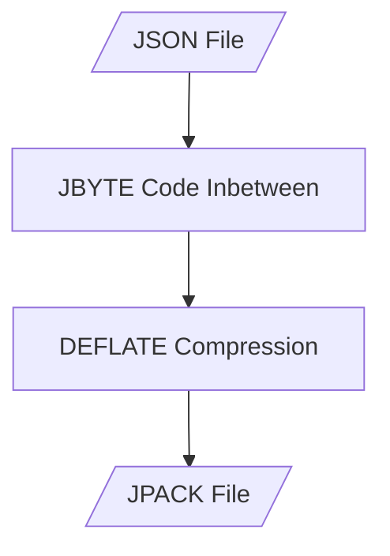

## JPACK 

A compressed format specifically designed around JSON patterns. A file format, jpack, and a tool for compressing, jtpack.

The flow:

```mermaid
flowchart TB
    n1["JSON File"] -->
    n2["JBYTE Code Inbetween"] -->
    n3["DEFLATE Compression"] -->
    n4["JPACK File"]

    n1@{ shape: in-out}
    n2@{ shape: proc}
    n3@{ shape:  proc}
    n4@{ shape: in-out}
```